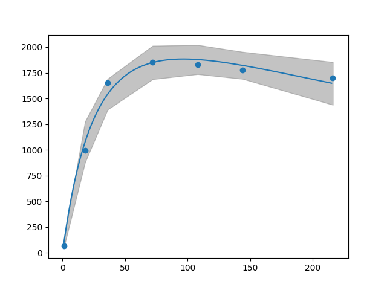

## Scalability Analysis Tools

[](https://travis-ci.org/mookerji/sca_tools)
[](https://codecov.io/gh/mookerji/sca_tools)
[](https://badge.fury.io/py/sca-tools)

`sca_tools` analyzes software scalability benchmarking experiments,
specifically measurements of throughput as a function of applied load
or concurrency. It is a Python library and set of command line
utilities and that will help you:
- Model and quantify throughput bottlenecks in your application
- Capacity plan
- Compare performance benchmarks for regressions

We rely on Neil Gunther's
[Universal Scalability Law](http://www.perfdynamics.com/Manifesto/USLscalability.html)
as a model and [lmfit](https://github.com/lmfit/lmfit-py) to perform
model fitting. `sca_tools` differs from existing implementations (see
[Related Work](#related-work)) in a few ways:
- Emphasis on robust parameter estimation
- Support for propagation of parameter uncertanties when computing
  derived quantities, such as latency, queue size, etc.
- Support for experimental measurement uncertainty
- Written using Scientific Python libraries

This is alpha software: use it at your **own risk** (e.g., don't use
it to make business decisions). It's very much a **work in progress**,
but currently includes:
- Fitting routines to the USL and basic reporting around
  goodness-of-fit for USL's convention and coherence parameters.
- Graph outputs for best fit model, best fit model confidence
  intervals, fit data, residuals, etc.
- Command line tools to produce these models from CSV data, as well
  as manipulate and aggregate CSV data from computer experiments.

## Usage

The `fixtures/` directory contains the SPEC SDM91 load-througput
benchmark ported from Stefan Möding's
[R implementation](https://github.com/smoeding/usl) of USL.

```shell
> python sca_tools/sca_fit.py --model_type usl fixtures/specsdm91.csv

----- Summary -----

[[Model]]
    Model(_usl_func)
[[Fit Statistics]]
    # function evals   = 41
    # data points      = 7
    # variables        = 3
    chi-square         = 27453.720
    reduced chi-square = 6863.430
    Akaike info crit   = 63.920
    Bayesian info crit = 63.758
[[Variables]]
    lambda_:   89.9954927 +/- 14.21296 (15.79%) (init= 1000)
    sigma_:    0.02772863 +/- 0.009121 (32.90%) (init= 0.1)
    kappa:     0.00010437 +/- 1.99e-05 (19.04%) (init= 0.001)
[[Correlations]] (unreported correlations are <  0.100)
    C(lambda_, sigma_)           =  0.964
    C(sigma_, kappa)             = -0.467
    C(lambda_, kappa)            = -0.243
```

Graphically:



## Related Work

- https://github.com/smoeding/usl
- https://github.com/codahale/usl4j

## Citations

- Neil J. Gunther. *Guerrilla Capacity Planning: A Tactical Approach
  to Planning for Highly Scalable Applications and
  Services*. Springer, Heidelberg, Germany, 1st edition, 2007.
- Baron Schwartz. *Practical Scalability Analysis with the Universal
  Scalability Law*. VividCortex, November 2015.

## License

Copyright © 2017 Bhaskar Mookerji

Distributed under the Apache License 2.0
